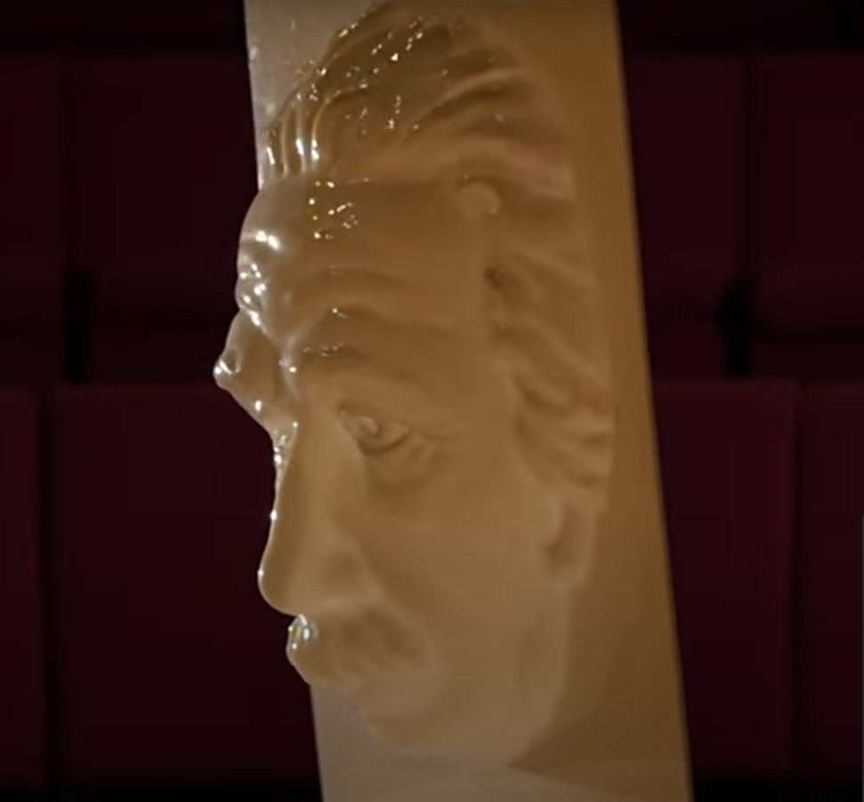
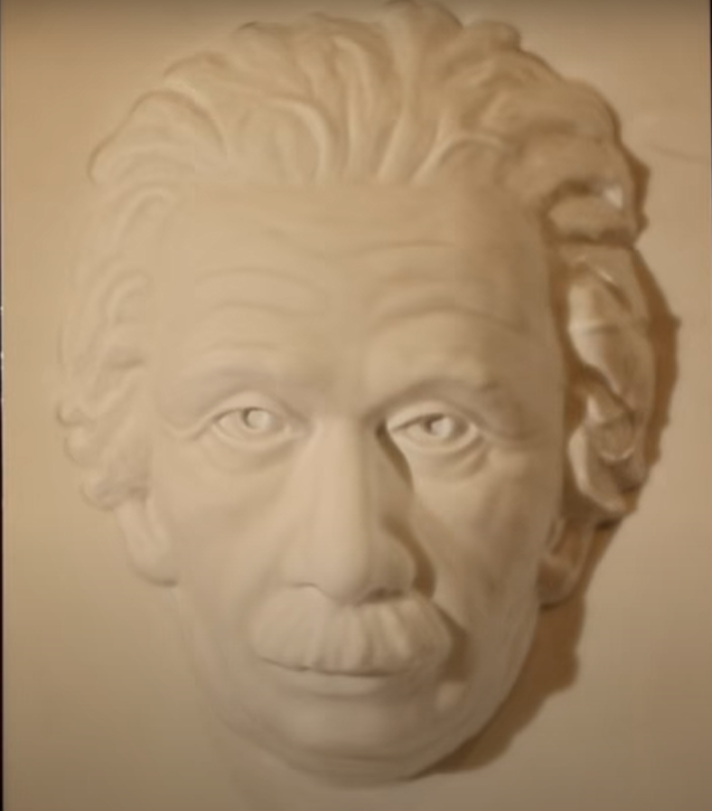
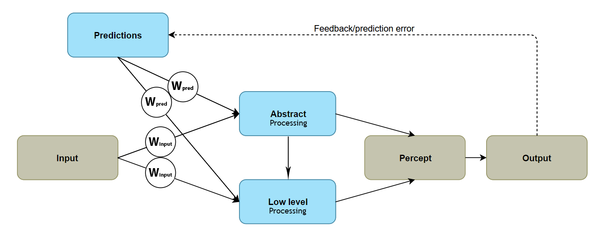
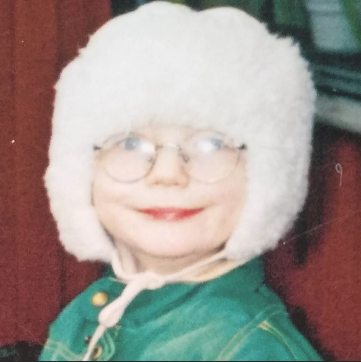

```{r setup, include=FALSE}
knitr::opts_chunk$set(echo = TRUE)
library(knitr)
```

<!-- Imagine that you one day wake up, everything appears normal but when you meet your family for breakfast you appear to speak a different language. No matter how hard you try, they cannot understand you. In fact, it is not only the language - you do not seem to share any common ground. When you are asking for the butter knife they hand you a glass of orange juice. The thought is unsettling, and unfortunately the reality for some. It is not difficult to imagine that if your idea of the world, your picture of what is going on, is unshared, that is a very isolating and terrifying experience. -->

> ...external perception is an internal dream which proves to be in harmony with external things; and instead of calling hallucination a false external perception, we must call external perception true hallucination.

The above quote from 19th century philospher Hippolyte Taine captures the elusive question: what do we mean by 'reality'? If you recognise the featured image, you have probably come across the game Hellblade: Senuas Sacrifice, where you follow Senua battle the cracking of her reality. The game was critically acclaimed for depicting the subjective experience of psychosis. 

The game makers worked closely with neuroscientists, one of which was [Paul Fletcher](https://www.neuroscience.cam.ac.uk/directory/profile.php?pcf22), a professor at Cambridge who has devoted much of his career to understanding the mechanisms of this disorder. I attended a talk of his a couple of months ago where he mentioned the game which immediately spiked my interest. Due to the current circumstances I had the chance to play through it this weekend - and it was a ride. I know my last post said I was gonna write more about power curves but after playing the game I couldn't resist a small post on this subject. A version of Fletcher's talk, in which he conveys the keystone ideas from his 20 years of research is available [here](https://www.youtube.com/watch?v=9rE5A1DDAFM).

To get as immersed as possible I played the game in complete darkness, with noise cancelling headphones and the volume high (which I sincerly recommend, since they put a lot of effort in to the audio). I nearly completed it in one sitting which also was prefereable for screening off as much of my world as possible and delve into that of Senua's psychosis. In this post I am going to go through some of the ideas they based the game on from Fletcher's research &#8210; which really shines through in both script and experience. 

The term 'psychosis' is not uncontroversial. If we define it loosely as losing contact with reality, it is easy to see why. Because what makes our healthy perception real? Fletcher makes the case that we are all a bit out of touch with reality. Most people simply hallucinate true events.

This might be difficult to grasp. But since your brain is encased in a skull and has no direct contact with the outside world it must create a predictive model of it. Hence, Fletcher argues, psychotic illness is just a small variation in normal perceptive processing.

Why do we have a brain? A fundemental fact of biological life is that the genes that most easily continue to exist tend to do just that. In a complex and noisy world, a machine that can make predictions about it would benefit any organism.

In a sense then, our brain is like a scientist, trying to draw inferences and make predictions from incomplete data. To do this one utilises expectations. Information from previous experiences that make our predictions more or less likely. If our predictions do not match the external world we must update them (in science and in life) with the given feedback. One can imagine the power of such device just by looking at how science has benefitted society.

This creates loops of predictions, inputs and prediction errors that integrate to form a stable perception. It is a breakdown in these integration processes that causes the psychotic state, Fletcher argues.

Perception has two foundations: input and predictions. Take a look at the [hollow mask illusion](https://www.youtube.com/watch?v=pH9dAbPOR6M):

<!--    -->

```{r echo=F, fig.show='hold', fig.align='center', out.width="20%", out.height="25%"}

include_graphics(c("hollow_face3.png", "hollow_face2.png", "hollow_face1.png"))
 
```

In the bottommost image we see a convex surface. The facial features however, make us expect it to be concave. Therefore it appears as such. It is easy to imagine how more abstract ideas could shape perceived input as well. For example, [facial expressions being interpreted differently depending on contexts](https://blogs.scientificamerican.com/observations/how-do-you-know-which-emotion-a-facial-expression-represents/). 

This mechanism can also be *additive*. Take the Kanizsa triangle, for example, where it is almost impossible not to see a white triangle laying over the other shapes even though it is not there:

```{r echo=F, fig.show='hold', fig.align='center', out.width="100%", out.height="25%"}
include_graphics("pngwave.png")
```

So, expectations *create* perceptions. Fletcher describes a system that tries to maintain stability between predictions and input. To best align your internal world with the external. This happens at multiple levels &#8210; from abstract (expressions) to concrete (Kanizsa triangle). Below is my interpretation of this system, W = weight.

<!-- *Note*: this is *my* interpretation of Fletcher's model. W = weight. -->



You can see that a balance between input and predictions must be maintained. If one gets too weighted it affects perception. For example if the input is cut off, predictions get an overbalance and hence your mind takes control of your perception and hallucinations might be induced - which often happen during e.g. [sensory deprivation](https://www.ncbi.nlm.nih.gov/pubmed/19829208).

Fletcher also mention that traumatic experiences, such as child abuse, could cause abstract predictions being unreasonably weighted. E.g. predicting low self worth could in a downstream manner affect how you see and interpret aspects of the world. Perhaps it would seem more ill-willed. Similarily such prediction might cause additive percepts of, for example, derogatory voices. This would correspond to the two cornerstones of pyschosis, delusion and hallucination respectively. 

Psychotic traits is, by this model, hence formed by too strong predictions. But strong predictions can also aid your perception. Imagine looking at a painting in your home during night. Since you know it, it's easier to see the contours, right? If you don't believe me, try to discern the image below:

<!-- It also means that hallucination prone individuals would be be more sensitive to detect stimuli to which they have already been exposed. Because their perception is to a higher degree weighted by prediction. Try to discern what the picture below depicts without scrolling. -->

<!-- Like any explanatory model worth its name this gives us a few testable hypotheses. One is that hallucination prone people would be more sensitive to detect stimuli one has already been exposed to. Because your perception is more heavily based on prediction and hence previous experience. Try to discern what the picture below depicts without scrolling. -->

```{r echo=F, fig.show='hold', fig.align='center', out.width="100%", out.height="25%"}
include_graphics("tanntannbw.png")
```

Not very easy, right? I, however, cannot not see myself as a kid:

```{r echo=F, fig.show='hold', fig.align='center', out.width="100%", out.height="25%"}

```

Given Fletcher's model, hallucination prone individuals would thus be *better* at these types of tasks (given previous exposure, so that they have something to expect). This was also [found](https://www.ncbi.nlm.nih.gov/pubmed/26460044) by him and colleagues. 

Further evidence both for and against the model is reviewed in the [talk](https://www.youtube.com/watch?v=9rE5A1DDAFM). But I do not want to spoil all the fun and advise you to take a look at it.

I should also make it clear that Fletcher does not claim that this model paint a complete picture. I for one am a bit sceptical about the hierarchical structure of the integration processes. However, if you are interested in this stuff (who wouldn't be interested in what reality is, eh?) Fletcher makes a compelling case. Playing through Hellblade after you've watched the talk makes it even more compelling as the ideas are communicated by experiencing them &#8210; which is both thought provoking and generates an understanding and compassion for the people suffering from this. (You could also use drugs, but I'd give Hellblade a go first).

